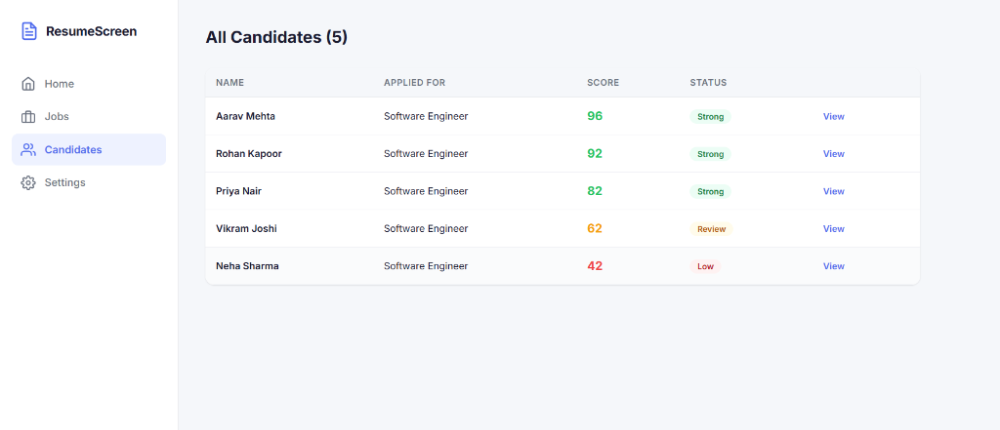
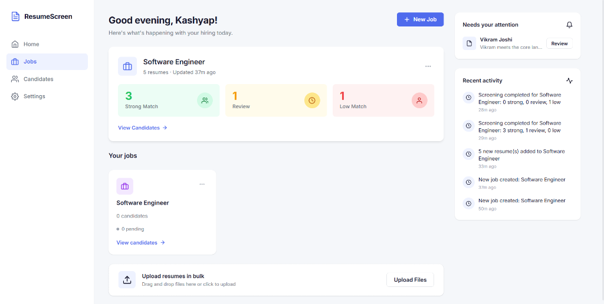
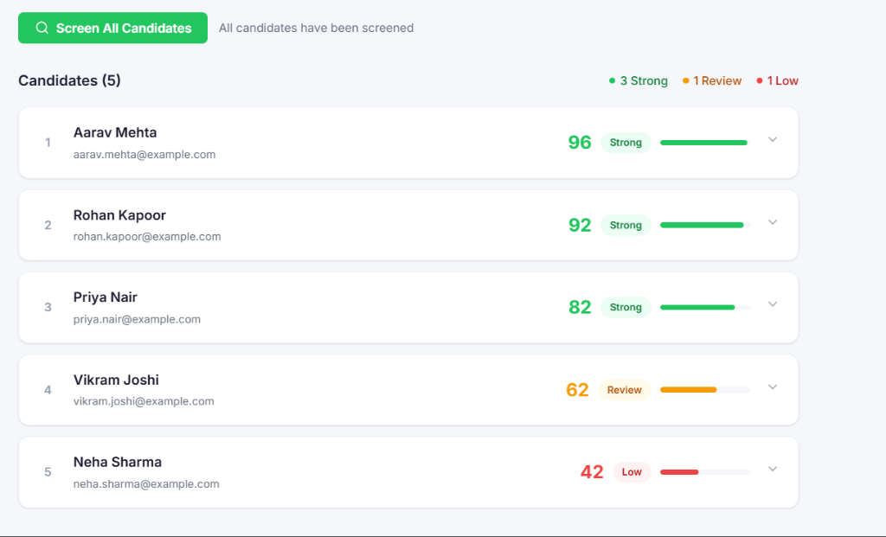
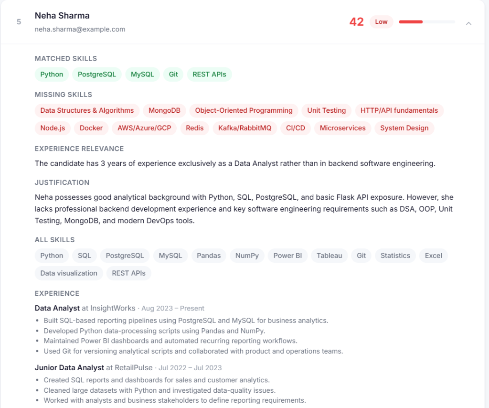

# Smart Resume Screener

A batch-processing ATS (Applicant Tracking System) tailored for precise, qualitative resume screening. 

Instead of relying on rigid keyword-matching, this system leverages Gemini 3.6 Flash to extract structured data from resumes and semantically match candidates against a provided job description. It generates an accurate score alongside a detailed justification outlining matched skills, missing technical requirements, and experience relevance.

[**View Live Demo**](https://resume-screener-v39l.onrender.com/)

*(Note: To use the live demo, enter a free Gemini API key in Settings. The key is held securely in your browser's local storage and the server's memory—it is never written to disk.)*

## Features

- **Semantic Matching**: Identifies equivalents (e.g., `React` ≈ `ReactJS`, `Postgres` ≈ `PostgreSQL`) rather than failing on exact keyword matches.
- **Batch Processing**: Upload multiple resume PDFs simultaneously to screen an entire pipeline in one click.
- **Detailed Justifications**: Candidates aren't just scored; the system explicitly lists matched/missing skills and explains *why* the score was given based on their experience.
- **Zero Configuration**: Built with a FastAPI + SQLite backend and a Vanilla JS frontend. No heavy JavaScript frameworks, no build steps required.

## Previews

### Dashboard & Activity Feed


### Candidates Overview


### Job Detail & Batch Upload


### Deep Analysis & Extraction


## Local Development

### Requirements
- Python 3.10+
- [Google AI Studio API Key](https://aistudio.google.com/api-keys) (Free)

### Setup

1. **Clone the repository**
   ```bash
   git clone https://github.com/Kashyap-2005/ResumeScreener.git
   cd ResumeScreener
   ```

2. **Install dependencies**
   ```bash
   pip install -r requirements.txt
   ```

3. **Start the server**
   ```bash
   python server.py
   ```
   *The server will start on `http://localhost:8000`.*

## Tech Stack

- **Backend**: FastAPI, Python
- **Database**: SQLite
- **LLM Engine**: Google Gemini 3.6 Flash
- **PDF Parsing**: `pdfplumber`
- **Frontend**: Vanilla HTML/CSS/JS (Custom Hash Router)
