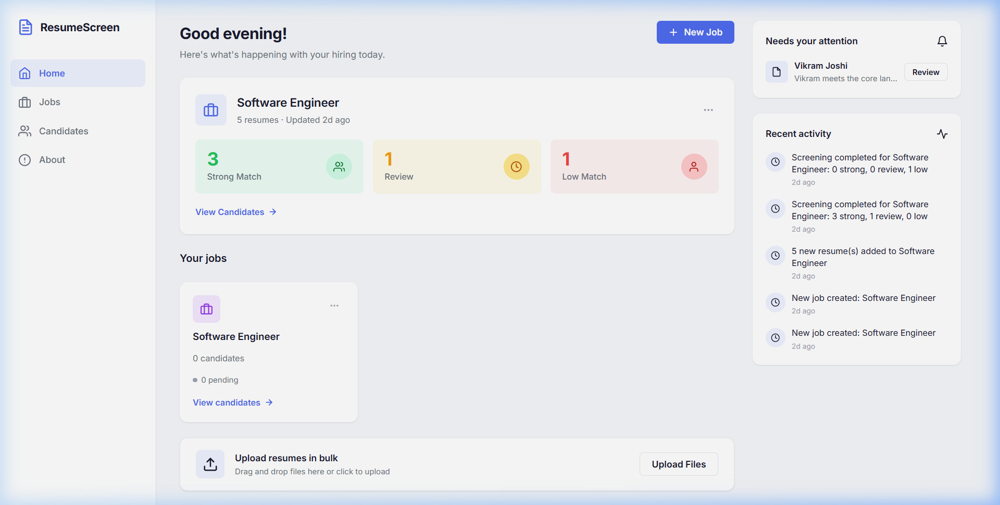
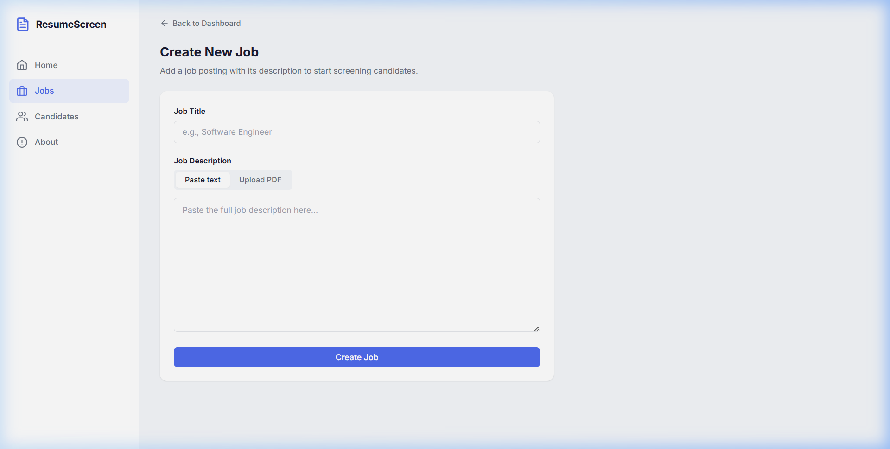
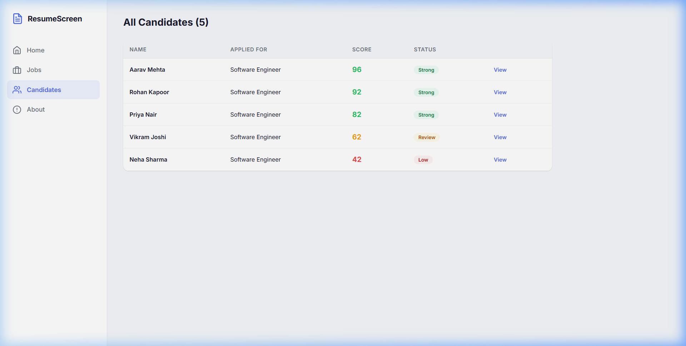
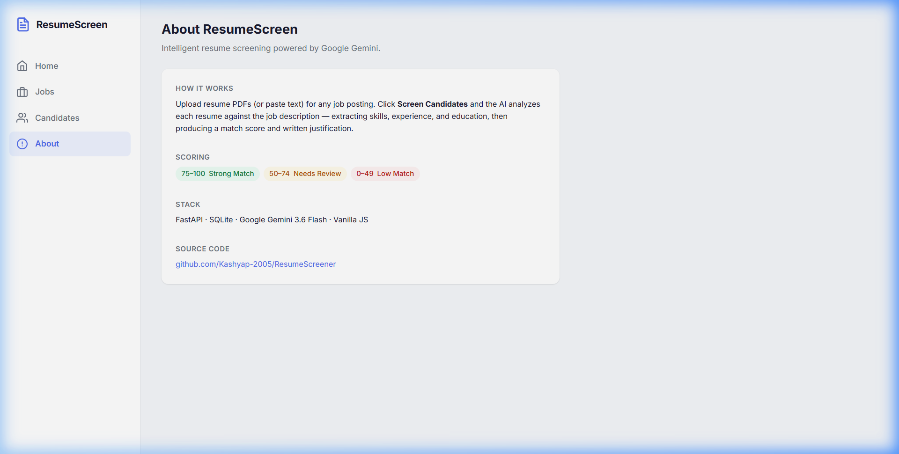

# ResumeScreen

A resume screening tool I built to replace manual shortlisting. Instead of reading through every resume, you paste a job description and upload PDFs — the app extracts skills, experience, and education from each resume, then scores and ranks candidates against the JD using semantic matching via Google Gemini.

**Live:** https://resume-screener-v39l.onrender.com/

---

## What it does

Most resume screeners do a simple keyword search — if the JD says "ReactJS" and the resume says "React", it fails. This one understands equivalents and uses the LLM to reason about fit, not just count words.

For each candidate it produces:
- A **match score out of 100**
- A list of **matched skills** (with semantic equivalents resolved)
- A list of **missing skills** the JD requires
- A short **justification** explaining why the score was given
- A full breakdown of extracted **experience, education, and projects**

---

## Screenshots

### Dashboard
The home screen shows your active job, a 3-way breakdown of results (Strong / Review / Low), a "Needs attention" panel for borderline candidates, and a live activity feed.



### Create a Job
Add a job title and paste (or upload as PDF) the full job description. This becomes the benchmark everything gets matched against.



### All Candidates
A sortable table view across all jobs — name, which role they applied for, score, and status at a glance.



### About
The About page explains how the scoring works. No config needed — the app is ready to use out of the box.



---

## Tech

| Layer | Choice | Why |
|---|---|---|
| Backend | FastAPI (Python) | Fast to write, automatic API docs, async support |
| Database | SQLite | Zero config, no separate server needed, perfectly fine for batch workloads |
| LLM | Google Gemini 3.6 Flash | Free tier, fast, structured JSON output via response schema |
| PDF parsing | pdfplumber | Handles multi-column layouts and preserves text order reliably |
| Frontend | Vanilla HTML/CSS/JS | No build step, no framework overhead, hash-based SPA router |

### Database schema

Three tables, kept deliberately flat:

```
jobs
  id, title, description, created_at, updated_at

candidates
  id, job_id (FK → jobs), resume_text,
  name, email, phone,
  skills (JSON), experience (JSON), education (JSON), projects (JSON),
  match_score, matched_skills (JSON), missing_skills (JSON),
  experience_relevance, justification, category,
  screened (bool), created_at

activity_log
  id, job_id (FK → jobs), message, created_at
```

JSON columns store lists/objects directly as strings. `ON DELETE CASCADE` is set so deleting a job clears its candidates automatically.

### Gemini integration

One API call per resume. The prompt asks for extraction and matching in a single pass, and the response is constrained to a typed Pydantic schema via `response_mime_type: application/json`. This keeps usage well within the free tier (15 RPM, 1500 requests/day) even when screening a full batch.

---

## Running locally

```bash
git clone https://github.com/Kashyap-2005/ResumeScreener.git
cd ResumeScreener
pip install -r requirements.txt
python server.py
# → http://localhost:8000
```

Set `GEMINI_API_KEY` as an environment variable before starting, or the screening step will fail.

```bash
# Windows
set GEMINI_API_KEY=your_key_here
python server.py

# or add it to a .env file (not committed)
```

Get a free API key at [aistudio.google.com/api-keys](https://aistudio.google.com/api-keys).

---

## Project structure

```
ResumeScreen/
├── server.py          # FastAPI app — endpoints, PDF parsing, Gemini calls
├── database.py        # SQLite schema + CRUD helpers
├── requirements.txt   # 5 dependencies
├── render.yaml        # Render deployment config
├── assets/            # Screenshots for this README
└── static/
    ├── index.html     # App shell
    ├── style.css      # Design system (~800 lines, no framework)
    └── app.js         # SPA — hash router, views, API calls
```
